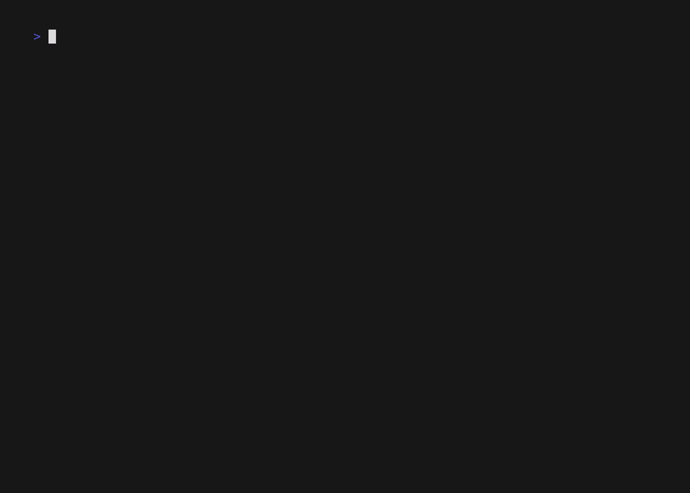

<div align="center">
  <h1>️ pebble </h1>
  &nbsp
  <h5>Pebble is a simple tool to send JSON files as messages to AWS SQS</h5>
</div>



## Installation
### Homebrew
```console
brew tap leberjs/tools
brew install pebble
```

[Latest release](https://github.com/leberjs/pebble/releases/latest) binary

## Usage
Run
```sh
pbl
```

Run `pbl --help` for more info:
```
Usage:
  pbl [flags]

Flags:
  -h, --help                 help for pbl
      --profile-name string  aws profile name
      --queue-url string     aws queue url
```

## Configuration
The first time you run `pbl` a new directory and configuration file will be created at `~/.pebble/pebble.toml`. A sub-directory, `sync` will also
be created. This is where the JSON files containing SQS messages should be stored.

```toml
[settings]
profile-name = 'sandbox'
queue-url = 'https://sqs.us-east-1.amazonaws.com/111111111111/my-queue'
```
